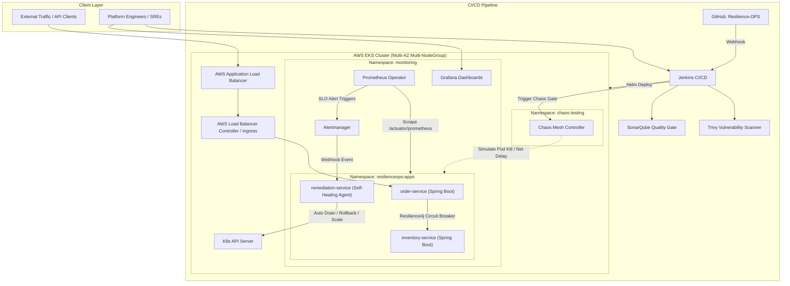

# ResilienceOps: Self-Healing Cloud Platform

[](docs/architecture.md)
[](docs/architecture.md)
[](docs/architecture.md)
[](infra/terraform/)
[](ci-cd/jenkins/)
[](docs/architecture.md)
[](chaos/)

ResilienceOps is an enterprise-grade cloud-native reference platform engineered for high availability and autonomous self-healing. Built on **AWS EKS**, **Java Spring Boot microservices**, **Terraform**, **Jenkins**, **Helm**, **Prometheus & Grafana**, and **Chaos Engineering**, it guarantees **99.9% availability** (~43.8 minutes allowable downtime/month) and an automated **Recovery Time Objective (RTO) under 5 minutes**.

---

## 📑 Core Documentation

1. **[Architecture Specification](docs/architecture.md)**
   - High-level system architecture diagrams (Mermaid)
   - EKS multi-AZ cluster topology & network security
   - Dual-loop self-healing mechanism (Kube-native fast loop + Prometheus-driven deep loop)
   - 99.9% availability & $\le 5$-minute RTO mathematical analysis
2. **[Repository Structure Recommendation](docs/folder-structure.md)**
   - Monorepo structure, rationale, and tooling
   - Organization across services, infrastructure, deployment, and chaos manifests
3. **[Core Microservices Specification](docs/services-spec.md)**
   - `order-service`: Core transaction processing with Circuit Breakers & Outbox pattern
   - `inventory-service`: High-concurrency stateful inventory management with Bulkheads & Rate Limiters
   - `remediation-service`: Intelligent self-healing agent receiving Alertmanager webhooks and driving automated remediation
4. **[Architecture Decision Records (ADRs)](docs/decision-log.md)**
   - Trade-off analysis covering Monorepo vs Multi-repo, Alert-driven remediation vs Operator, RTO optimization, Helm umbrella vs Kustomize, and Chaos Mesh vs LitmusChaos

---

## 🏛️ System Architecture At A Glance



---

## 🔄 Self-Healing Loops & RTO Targets

| Failure Scenario | Detection Time | Remediation Action | Recovery Time (RTO) |
| :--- | :--- | :--- | :--- |
| **Pod Crash / OOMKilled** | 5 – 10 seconds | Kubelet auto-restarts pod via Liveness probe | **< 30 seconds** |
| **Node Failure / AZ Outage** | 30 – 45 seconds | EKS Auto Scaling Group + Karpenter spins replacement node; Pods rescheduled across healthy AZs via PodAntiAffinity | **< 3 minutes** |
| **Cascading Downstream Latency** | Immediate (< 1s) | Resilience4j Circuit Breaker opens; fallback to cached responses / degraded mode | **< 1 second** |
| **Faulty Release / Bad Canary** | 60 – 90 seconds | Prometheus detects error rate > 1%; Alertmanager triggers `remediation-service` automated Helm rollback | **< 2.5 minutes** |
| **Memory Leak / Deadlock** | 30 – 60 seconds | Spring Boot liveness failure or Alertmanager webhook $\rightarrow$ automated rolling restart | **< 2 minutes** |

---

## 🚀 Directory Structure Overview

```text
.
├── .github/                 # GitHub workflows & templates
├── docs/                    # Architecture, ADRs, and technical specs
│   ├── architecture.md      # Detailed system architecture & diagrams
│   ├── folder-structure.md  # Monorepo layout and best practices
│   ├── services-spec.md     # 3 Core microservices specifications
│   └── decision-log.md      # Architecture Decision Records (ADRs)
├── services/                # Java Spring Boot Microservices
│   ├── order-service/       # Order orchestration & transaction boundary
│   ├── inventory-service/   # Stock reservation & optimistic concurrency
│   └── remediation-service/ # Self-healing webhook consumer & k8s controller
├── infra/                   # Infrastructure as Code
│   └── terraform/           # Terraform modules (VPC, EKS, RDS, Monitoring)
├── deploy/                  # Deployment packages
│   └── helm/                # Helm charts for services & umbrella platform
├── ci-cd/                   # Continuous Integration & Delivery
│   └── jenkins/             # Jenkinsfile, shared libraries, and test pipelines
└── chaos/                   # Chaos engineering manifests (Chaos Mesh)
```

---

## 🐳 Local Development & Testing (Docker Compose)

The entire microservice fleet and local observability loop can be spun up with a single command:

```bash
docker compose up --build -d
```

### Local Services & Ports

| Component | Port | Description | Health / Metrics Endpoint |
| :--- | :--- | :--- | :--- |
| **`order-service`** | `8080` | Order checkout & circuit breaker coordinator | `http://localhost:8080/actuator/health` |
| **`inventory-service`** | `8081` | High-concurrency inventory ledger | `http://localhost:8081/actuator/health` |
| **`remediation-service`** | `8082` | Autonomous self-healing agent | `http://localhost:8082/actuator/health` |
| **`prometheus`** | `9090` | Time-series scraper & alerting engine | `http://localhost:9090/targets` |
| **`alertmanager`** | `9093` | Alert grouping & webhook delivery engine | `http://localhost:9093` |
| **`grafana`** | `3000` | Pre-configured golden signals dashboard (admin / `resilienceops`) | `http://localhost:3000` |

### Simulating a Local Self-Healing Incident

1. **Trigger deliberate chaos on `order-service`**:
   ```bash
   curl -X POST http://localhost:8080/api/v1/admin/chaos/simulate-failure \
     -H "Content-Type: application/json" \
     -d '{"action": "memory-leak", "megabytes": 150}'
   ```
2. **Observe Prometheus** (`http://localhost:9090/alerts`) transition `JvmMemorySaturation` from `PENDING` to `FIRING`.
3. **Inspect Alertmanager** (`http://localhost:9093`) dispatching the webhook to `remediation-service`.
4. **Verify remediation audit log**:
   ```bash
   curl http://localhost:8082/api/v1/remediation/history
   ```

---

## 👥 Contributors & Repository Maintenance

- Repository: [https://github.com/kantinilesh/Resilience-OPS](https://github.com/kantinilesh/Resilience-OPS)
- Architecture Lead & Author: Nilesh Kanti

