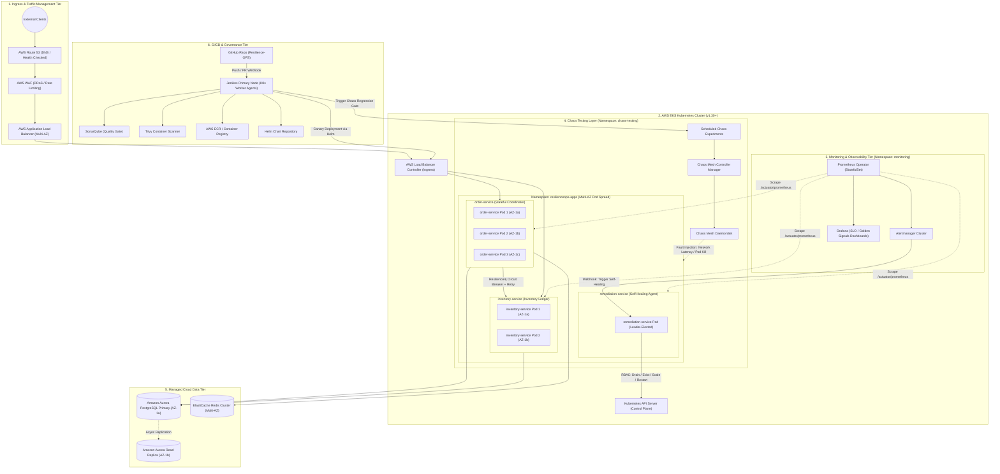
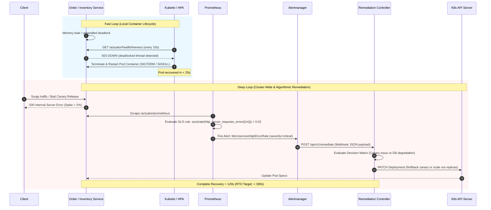

# Architecture Specification: ResilienceOps Platform

## 1. Executive Summary

**ResilienceOps** is a high-reliability, self-healing cloud platform engineered to deliver **99.9% availability** (three nines) and a maximum **5-minute Recovery Time Objective (RTO)** across infrastructure, container orchestration, microservices runtime, and deployment lifecycles.

### Availability & RTO Objectives

$$\text{Allowable Unplanned Downtime} = 365.25 \times 24 \times (1 - 0.999) \approx 8.76 \text{ hours/year} \ (43.8 \text{ min/month})$$

To achieve these targets without human intervention, ResilienceOps shifts from **passive fault tolerance** to **active autonomous self-healing** across two coordinated feedback loops:
1. **Fast Reactive Loop (Sub-30 seconds)**: Local Kubernetes kubelet probes, Horizontal Pod Autoscaler (HPA), and pod restarts.
2. **Deep Intelligent Loop (Sub-3 minutes)**: Prometheus SLO-based metric evaluation, Alertmanager webhook routing, and an automated `remediation-service` executing cluster-level mitigations, canary rollbacks, or traffic rerouting.

---

## 2. High-Level Architecture Diagram

The diagram below illustrates the end-to-end topology of ResilienceOps on AWS EKS, including ingress routing, microservice tiers, observability, self-healing automation, CI/CD, and chaos engineering.



---

## 3. Core Component Breakdown

### 3.1 App Services (Spring Boot Microservices)
The platform executes containerized Java 21 Spring Boot 3.x microservices:
- **`order-service`**: Handles checkout transactions. Uses **Resilience4j Circuit Breaker, Bulkhead, and Rate Limiter** to isolate slow downstream calls. Implements the **Transactional Outbox Pattern** to prevent data inconsistency during transient network partitions.
- **`inventory-service`**: Manages product allocations with optimistic locking in Aurora PostgreSQL and distributed locking via Redis. Uses local in-memory fallback caches when the primary database undergoes automated failover.
- **`remediation-service`**: Acts as the autonomous brain. It listens to Prometheus Alertmanager alerts via webhook, correlates symptoms using the Kubernetes API, and triggers automated remediation runs (e.g., rolling restart, canary rollback, cache purge, or scaling up).

### 3.2 EKS Cluster Architecture
- **Multi-AZ Distribution**: Deployed across 3 AWS Availability Zones (`us-east-1a`, `us-east-1b`, `us-east-1c`).
- **Topology Spread Constraints & Pod Anti-Affinity**: Ensures microservice replicas are evenly distributed across failure domains:
  ```yaml
  topologySpreadConstraints:
    - maxSkew: 1
      topologyKey: topology.kubernetes.io/zone
      whenUnsatisfiable: DoNotSchedule
      labelSelector:
        matchLabels:
          app.kubernetes.io/name: order-service
  ```
- **Compute Sizing & Karpenter Autoscaling**:
  - Critical control services run on **On-Demand** node groups.
  - Scale-out workloads run on a diversified pool of **Spot Instances** with automated graceful pre-emption draining (using AWS Node Termination Handler).
  - Rapid scale-out from 0 to 100 pods in < 45 seconds via Karpenter.

### 3.3 Monitoring & Observability Stack
The platform uses the **Prometheus Operator** (`kube-prometheus-stack`):
- **Metrics Scraping**: Polls `/actuator/prometheus` endpoints every 10 seconds.
- **ServiceMonitors & PodMonitors**: Declarative CRDs capturing JVM GC pauses, HTTP response latency percentiles (p50, p95, p99), connection pool exhaustion, and error rates (5xx HTTP responses).
- **Alertmanager Routing**: Routes alerts based on severity:
  - `P1-Critical` (High 5xx rate, Pod CrashLoopBackOff > 3 restarts) $\rightarrow$ Pushes webhook to `remediation-service` for automatic intervention.
  - `P2-Warning` (Latency p99 > 800ms) $\rightarrow$ Pushes to Slack/PagerDuty and invokes HPA scale out.
- **Grafana Visualizations**: Curated dashboards tracking Golden Signals (Latency, Traffic, Errors, Saturation) and SLO burn rates.

### 3.4 CI/CD Pipeline (Jenkins & Helm)
- **Declarative Pipeline**:
  1. Code checkout & Maven build with parallelized unit tests.
  2. SonarQube static code analysis & Trivy container vulnerability scanning.
  3. Multi-architecture Docker image build and push to AWS ECR.
  4. Helm linting & packaging.
  5. Deployment to staging namespace.
  6. **Chaos Resilience Gate**: Automatic execution of a 3-minute Chaos Mesh test suite. If the system fails to recover or error rates exceed 0.1%, the pipeline aborts.
  7. Automated canary release to production using Helm and Argo Rollouts / Flagger.

### 3.5 Chaos Testing Layer (Chaos Mesh)
Automated chaos injection is scheduled both in the staging deployment pipeline and during off-peak hours in pre-production:
- **`PodChaos`**: Randomly terminates order and inventory pods to verify pod recreation under 15 seconds.
- **`NetworkChaos`**: Injects 200ms latency and 10% packet drop between `order-service` and `inventory-service` to prove Resilience4j circuit breaker trips and fallback mechanisms activate.
- **`StressChaos`**: Injects 90% CPU / Memory load on worker nodes to confirm HPA and node autoscaling behavior.

---

## 4. Dual-Loop Self-Healing Architecture



---

## 5. RTO Breakdown: Recovery Time Objective ($\le 5$ Minutes)

To guarantee an RTO $\le 300$ seconds under any single component failure:

| Milestone / Phase | Typical Time | Maximum SLA Budget | Description |
| :--- | :--- | :--- | :--- |
| **Fault Detection** | 10 – 30 seconds | 60 seconds | Prometheus scraping interval (10s) + Alert rule evaluation window (30s). |
| **Alert Routing & Ingestion** | 2 – 5 seconds | 10 seconds | Alertmanager deduplication, grouping, and webhook delivery to `remediation-service`. |
| **Remediation Execution** | 15 – 45 seconds | 90 seconds | `remediation-service` executes Helm rollback, pod drain, or HPA scale override. |
| **Pod Start & Initialization** | 15 – 30 seconds | 60 seconds | Java Spring Boot startup with CDS (Class Data Sharing) / GraalVM optimizations; Kubelet readiness probe passes. |
| **Traffic Warmup & Rebalancing** | 10 – 20 seconds | 40 seconds | ALB Ingress health check passes and resumes full traffic routing. |
| **Total Cumulative Time** | **~80 seconds** | **260 seconds (< 5 min)** | **Fully complies with 5-minute RTO.** |

---

## 6. Network Security & Data Flow

1. **Zero-Trust Network Policies**: Kubernetes `NetworkPolicy` isolates namespaces. `resilienceops-apps` can only communicate with required database ports and observability endpoints.
2. **AWS IAM Roles for Service Accounts (IRSA)**: Fine-grained least-privilege AWS IAM roles assigned to Kubernetes pods without baking access keys into containers.
3. **mTLS Ready**: Microservice-to-microservice traffic can be encrypted in transit via lightweight service mesh (Linkerd / Cilium SPIRE).
